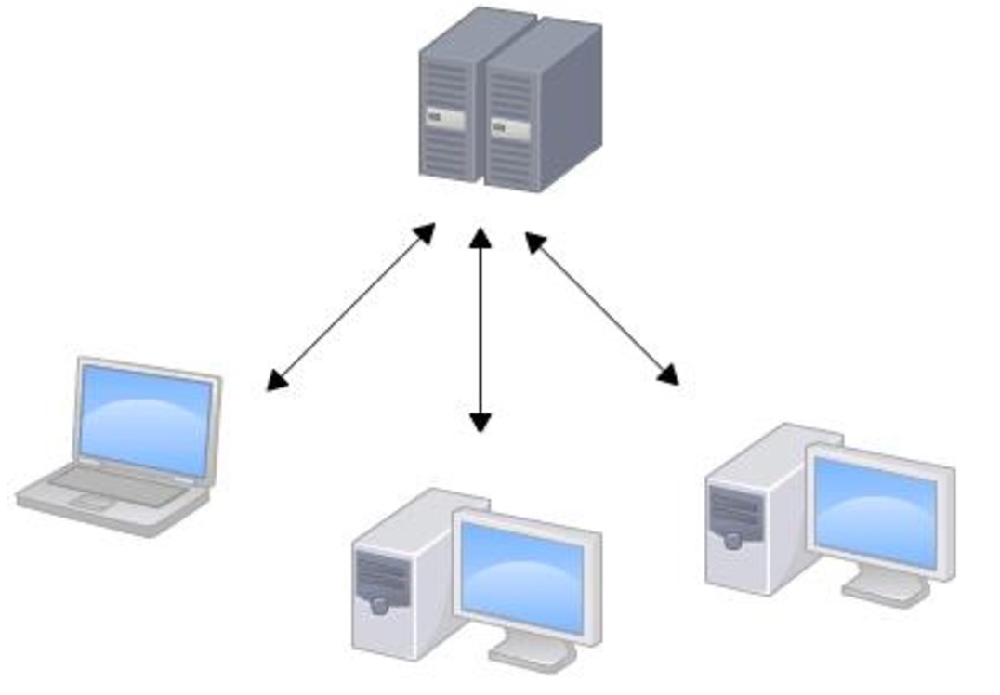
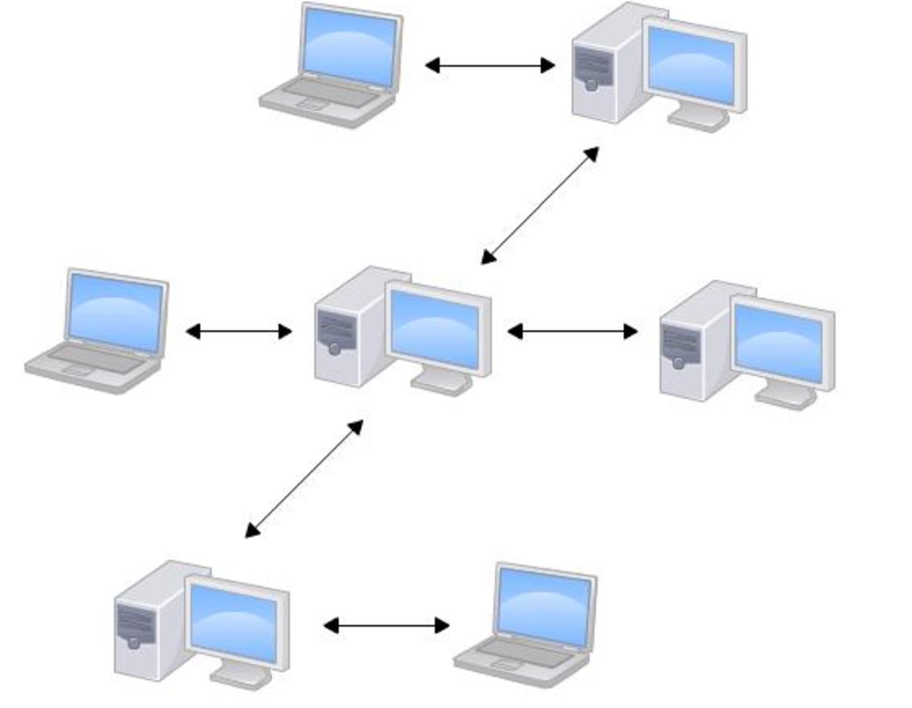

#Git

- 什么是Git
- 什么是GitHub
- Git的由来
- 分布式和集中式 Git   SVN
- Git和Github的使用

###什么是Git

分布式版本控制工具

### 什么是GitHub

Git仓库托管服务器

国内也有很多，git.oschina.net， https://coding.net/

### Git的由来

很多人都知道，Linus在1991年创建了开源的Linux，从此，Linux系统不断发展，已经成为最大的服务器系统软件了。

Linus虽然创建了Linux，但Linux的壮大是靠全世界热心的志愿者参与的，这么多人在世界各地为Linux编写代码，那Linux的代码是如何管理的呢？

事实是，在2002年以前，世界各地的志愿者把源代码文件通过diff的方式发给Linus，然后由Linus本人通过手工方式合并代码！

你也许会想，为什么Linus不把Linux代码放到版本控制系统里呢？不是有CVS、SVN这些免费的版本控制系统吗？因为Linus坚定地反对CVS和SVN，这些集中式的版本控制系统不但速度慢，而且必须联网才能使用。有一些商用的版本控制系统，虽然比CVS、SVN好用，但那是付费的，和Linux的开源精神不符。

不过，到了2002年，Linux系统已经发展了十年了，代码库之大让Linus很难继续通过手工方式管理了，社区的弟兄们也对这种方式表达了强烈不满，于是Linus选择了一个商业的版本控制系统BitKeeper，BitKeeper的东家BitMover公司出于人道主义精神，授权Linux社区免费使用这个版本控制系统。

安定团结的大好局面在2005年就被打破了，原因是Linux社区牛人聚集，不免沾染了一些梁山好汉的江湖习气。开发Samba的Andrew试图破解BitKeeper的协议（这么干的其实也不只他一个），被BitMover公司发现了（监控工作做得不错！），于是BitMover公司怒了，要收回Linux社区的免费使用权。

Linus可以向BitMover公司道个歉，保证以后严格管教弟兄们，嗯，这是不可能的。实际情况是这样的：

Linus花了两周时间自己用C写了一个分布式版本控制系统，这就是Git！一个月之内，Linux系统的源码已经由Git管理了！牛是怎么定义的呢？大家可以体会一下。

Git迅速成为最流行的分布式版本控制系统，尤其是2008年，GitHub网站上线了，它为开源项目免费提供Git存储，无数开源项目开始迁移至GitHub，包括jQuery，PHP，Ruby等等。

历史就是这么偶然，如果不是当年BitMover公司威胁Linux社区，可能现在我们就没有免费而超级好用的Git了。

### 分布式版本控制和集中式版本控制

Git 和 SVN

**集中式版本控制系统**，版本库是集中存放在中央服务器的，而干活的时候，用的都是自己的电脑，所以要先从中央服务器取得最新的版本，然后开始干活，干完活了，再把自己的活推送给中央服务器。中央服务器就好比是一个图书馆，你要改一本书，必须先从图书馆借出来，然后回到家自己改，改完了，再放回图书馆

**分布式版本控制系统**根本没有“中央服务器”，每个人的电脑上都是一个完整的版本库，这样，你工作的时候，就不需要联网了，因为版本库就在你自己的电脑上。既然每个人电脑上都有一个完整的版本库，那多个人如何协作呢？比方说你在自己电脑上改了文件A，你的同事也在他的电脑上改了文件A，这时，你们俩之间只需把各自的修改推送给对方，就可以互相看到对方的修改了

##### Git和SVN的优劣势

- Git
  - 优势: 
    - 分布式，没有网络也可以编写代码
    - 强大的分支结构
    - 适用于开源
  - 劣势: 
    - git是镜像文件，很浪费流量和更新时间
- SVN
  - 优势:
    - 服务器公司统一控制管理
    - 安全机制, 不会每个人都拷贝一份, 可以对组员限制, 也可以分配不同组
    - 开发人员的习惯
  - 劣势:
    - 没有很好的分支管理
    - 不适用于开源

### Git和Github的使用

终端常用命令:

* ls  查询当前目录文件
  * -a 所有全部，包括隐藏文件 
  * -l 详情，包含文件大小，文件权限，文件所属用户
* cd 切换目录
  * 相对路径  例：Image/
  * 绝对路径  例：/User/QCL/Desktop/Git/Image
  * ..  上级目录
  * ~ 家目录(小房子)
  * /  Root目录
* pwd 当前目录查询, 显示完整目录
* touch 创建文件
* rm 删除文件/文件夹
  * -r
  * -f
* mkdir 创建文件夹
* rmdir 删除文件夹
* file 显示文件类型
* mv 改变文件名或所在目录
* cat 显示或连接文件
* diff 比较并显示两个文件的差异

Git常用命令:

克隆版本库: git clone https://github.com/用户名/仓库名.git

添加修改: git add .

提交修改: git commit -m '修改的内容'

推送修改: git push
Git 讲解

    git clone

    git add .

    git commit -m''

    git pull

    git push
​    

将修改添加到暂存区

    git add .

将修改从暂存区移除

    git rm --cache<file> 

查询git状态

    git status

查询当前某文件与分支或暂存区中有何不用

    git diff HEAD -- <file>
#### 忽略特殊文件或文件夹

需要生成.gitignore文件，一般来说不需要自己创建

通过Gitignore地址去下载对应语言的.gitignore文件

> 使用node.js开发 则去下载Node.gitignore文件。

使用时，需要将Node.gitigonre改名为.gitignre

才会生效

#### .gitignore

在该文件中添加忽略规则，可以填入文件名／文件夹名

例：

在.gitignore中添加如下代码

    node_modules/

则该文件夹下所有文件／文件夹都会被.git忽略
=======

查看当前状态 ：git status

查看所有分支：git branch -a 

删除文件：git rm

查看版本：git tag

查看远程分支：git branch -r